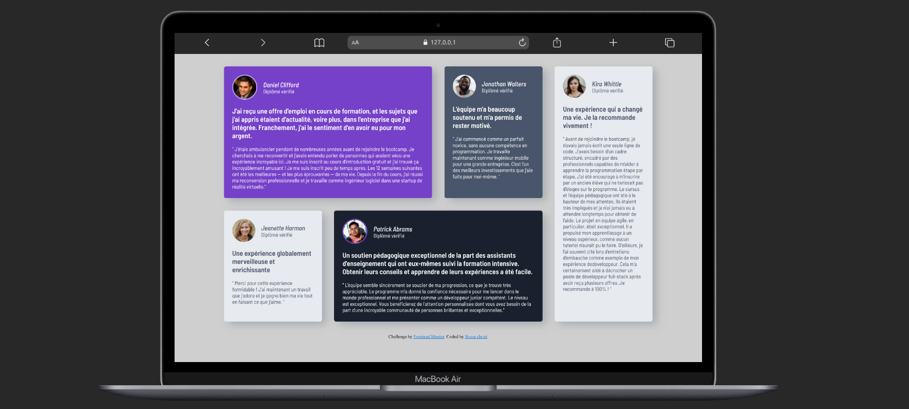

# Testimonials Grid Section

Une solution au challenge [Testimonials Grid Section sur Frontend Mentor](https://www.frontendmentor.io/challenges/testimonials-grid-section-Nnw6J7Un7).

## 📸 Aperçu

## 🔗 Liens

- **Site en direct (Live) :** [https://bossealias13.github.io/page-section-temoignagnes/]
- **Code Source :** [https://github.com/Bossealias13/page-section-temoignagnes]

## 🛠️ Construit avec

- **HTML5 Sémantique**
- **CSS3** (Variables CSS, Flexbox, CSS Grid)
- **Workflow Mobile-First**

👤 Auteur
Bosse Christ

Frontend Mentor - [@Bossealias13]
